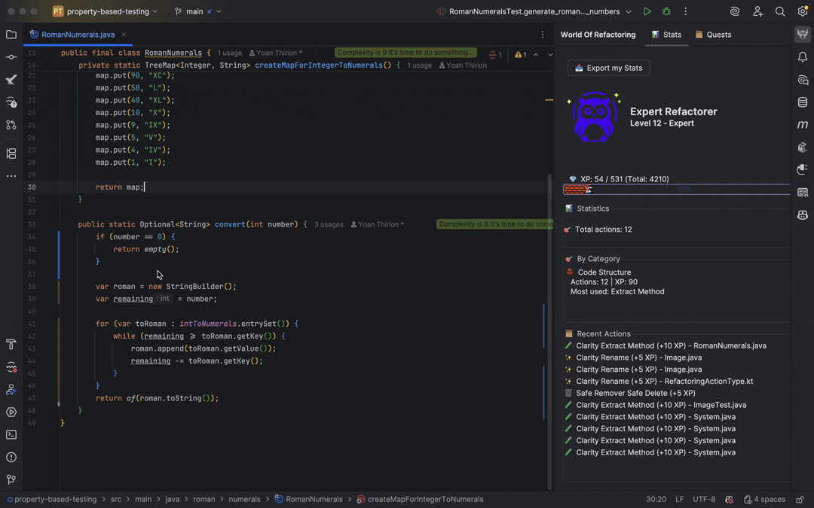
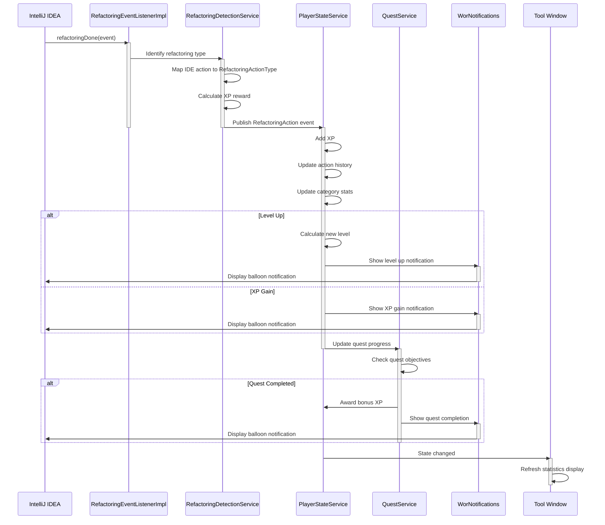

# World Of Refactoring


[](https://plugins.jetbrains.com/plugin/30127-wor)
[](https://plugins.jetbrains.com/plugin/30127-wor)
[](https://claude.ai/code)
[](LICENSE)



<!-- Plugin description -->

**World of Refactoring** transforms your IntelliJ IDEA refactoring workflow into an engaging experience! Earn XP, level
up, and complete quests as you improve your codebase.

## Features

### Progression System

- **Gain XP** for every refactoring action you perform
- **Level up** through 6 distinct tiers with unique titles and icons:
    - 🌱 **Apprentice** (Levels 1-4)
    - ⚔️ **Refactorer** (Levels 5-9)
    - 🛡️ **Expert** (Levels 10-19)
    - 🎖️ **Master** (Levels 20-29)
    - 👑 **Grand Master** (Levels 30-50)
    - 🧙 **Legend** (Level 51+)

### Comprehensive Action Tracking

Track your refactoring actions across 4 categories:

- **Code Structure** - Extract Method, Inline, Move, etc.
- **Logic & Complexity** - Simplify logic, reduce complexity
- **Data & State** - Encapsulation, data management
- **Coupling** - Dependency management

Supports 20+ refactoring types including:

- Extract Method/Variable/Constant/Interface
- Rename, Move, Copy
- Inline Method/Variable
- Change Signature
- Pull Up/Push Down
- And many more!

### Quest System

Complete quests to earn bonus XP:

- **First Steps** - Perform your first 5 refactoring actions
- **Extract Expert** - Master the Extract Method refactoring
- **Rename Champion** - Become proficient at renaming
- **Spring Cleaning** - Clean up your codebase

### Statistics Dashboard

View detailed statistics in the dedicated tool window:

- Current level, title, and progression bar
- Total XP and actions performed
- Breakdown by action category
- Complete refactoring history

### Real-time Notifications

Get instant feedback when you:

- Gain XP from refactoring actions
- Level up and unlock new titles
- Complete quests

### Export Your Progress

Export your statistics in `Markdown`: formatted reports with level icons.

## Installation

1. Open IntelliJ IDEA
2. Go to `Settings` → `Plugins` → `Marketplace`
3. Search for `World of Refactoring`
4. Click `Install` and restart your IDE

## Usage

Once installed, the plugin automatically tracks your refactoring actions:

1. **Open the Tool Window**: Find "World Of Refactoring" in the right sidebar
2. **Start Refactoring**: Perform any refactoring action (Extract Method, Rename, etc.)
3. **Watch Your Progress**: See notifications for XP gains and level ups
4. **Check Your Stats**: View detailed statistics in the Stats tab
5. **Complete Quests**: Track your progress in the Quests tab
6. **Export Your Data**: Use the export button to save your achievements

<!-- Plugin description end -->

## Architecture

### Event Flow

The plugin automatically detects and rewards refactoring actions through an event-driven architecture:



### Key Components

- **RefactoringEventListenerImpl**: Listens to IntelliJ's refactoring events
- **RefactoringDetectionService**: Maps IDE events to game actions and calculates rewards
- **PlayerStateService**: Manages player progression, XP, and statistics (persisted)
- **QuestService**: Tracks and validates quest completion (persisted)
- **WorNotifications**: Displays balloon notifications for XP gains and achievements
- **Tool Window**: Real-time UI displaying stats, quests, and player progression

## XP Rewards

Different refactoring actions provide different XP amounts based on their complexity:

- **Extract Method/Interface**: 10 XP
- **Rename**: 5 XP
- **Inline Method**: 8 XP
- **Move/Copy**: 7 XP
- **Change Signature**: 12 XP
- And more!

## Supported Refactoring Actions

The plugin uses exact IDE action IDs (priority 1) and keyword fallback for other IDEs (priority 2).

| Refactoring       | WebStorm ID                                        | IntelliJ IDEA ID                    | Keyword fallback                                                      |
|-------------------|----------------------------------------------------|-------------------------------------|-----------------------------------------------------------------------|
| Extract Method    | `refactoring.javascript.extractMethod`             | `refactoring.extract.method`        | `extract` + `method/function`, `ExtractFunction`, `IntroduceFunction` |
| Inline Method     | `refactoring.javascript.inline.method`             | `refactoring.inline.method`         | `inline` + `method/function`, `InlineFunction`                        |
| Inline Variable   | `refactoring.javascript.inline`                    | `refactoring.inline.local.variable` | `inline` + `variable`, `InlineVariable`                               |
| Move Method       | `refactoring.javascript.es6.moveModule`†           | `refactoring.move.members`          | `move` + `method/function`, `Move`                                    |
| Move Class        | `refactoring.javascript.es6.moveModule`†           | `refactoring.move`                  | `move` + `class`                                                      |
| Rename            | `refactoring.inplace.rename`, `refactoring.rename` | same                                | `rename`, `RenameElement`                                             |
| Change Signature  | `refactoring.javascript.change.signature`          | `refactoring.changeSignature`       | `ChangeSignature`, `change` + `signature`                             |
| Remove Parameter  | `refactoring.safeDelete`‡                          | `refactoring.safeDelete`‡           | `remove` + `param`                                                    |
| Extract Variable  | `refactoring.javascript.introduceVariable`         | `refactoring.extractVariable`       | `extract/introduce` + `variable`, `IntroduceVariable`                 |
| Extract Constant  | `refactoring.javascript.introduceConstant`         | `refactoring.extractConstant`       | `extract/introduce` + `constant`, `IntroduceConstant`                 |
| Remove Dead Code  | `refactoring.safeDelete`‡                          | `refactoring.safeDelete`‡           | `remove` + `dead`                                                     |
| Encapsulate Field | _(not available)_                                  | `refactoring.encapsulateFields`     | `encapsulate` + `field/property`                                      |
| Safe Delete       | `refactoring.safeDelete`                           | `refactoring.safeDelete`            | `SafeDelete`, `safe_delete`                                           |

## Development

Built with:

- Kotlin
- IntelliJ Platform SDK 2025.2.5
- Kotest for testing
- Gradle for build automation

## How to Release

This project uses an automated release workflow through GitHub Actions. Follow these steps to create a new release:

### Release Process Overview

```
Push to main → Build Workflow → Draft Release Created → Manual Publish → Release Workflow → JetBrains Marketplace
```

### Step-by-Step Release Guide

#### 1. Prepare the CHANGELOG

Update `CHANGELOG.md` with your changes under the `[Unreleased]` section:

```markdown
## [Unreleased]

### Added

- New features you've added

### Changed

- Changes to existing functionality

### Fixed

- Bug fixes
```

**Important:** Always maintain an `[Unreleased]` section at the top of your changelog.

#### 2. Update the Version

Edit `gradle.properties` and increment the version number:

```properties
pluginVersion=0.0.2  # Update this (following SemVer)
```

**Version Format (SemVer):**

- `0.0.x` - Patch: Bug fixes and minor changes
- `0.x.0` - Minor: New features, backwards compatible
- `x.0.0` - Major: Breaking changes

#### 3. Commit and Push

```bash
git add CHANGELOG.md gradle.properties
git commit -m "chore: prepare release 0.0.2"
git push origin main
```

#### 4. Wait for Build Workflow

The Build workflow will automatically:

- ✅ Build the plugin
- ✅ Run tests
- ✅ Inspect code with Qodana
- ✅ Verify plugin compatibility
- ✅ **Create a Draft Release** on GitHub with changelog content

#### 5. Review and Publish the Release

1. Go to your [GitHub Releases page](https://github.com/ythirion/wor/releases)
2. You'll see a **Draft Release** with version `0.0.2`
3. Review the release notes (automatically extracted from `[Unreleased]`)
4. Click **"Publish release"**

#### 6. Automatic Publication

Once published, the Release workflow automatically:

- ✅ Updates the CHANGELOG (moves `[Unreleased]` to versioned section)
- ✅ **Publishes the plugin to JetBrains Marketplace**
- ✅ Uploads the plugin ZIP as a release asset
- ✅ Creates a Pull Request with the updated CHANGELOG

#### 7. Merge the Changelog PR

After the release, a PR will be created to update the CHANGELOG. Review and merge it.

### CHANGELOG Format Example

Your CHANGELOG should follow this format:

```markdown
# WoR - World Of Refactoring

## [Unreleased]

### Added

- Features for the next release

## [0.0.2] - 2026-02-11

### Added

- Global state persistence across projects
- Quest progress saving

### Changed

- Services now run at Application level

## [0.0.1] - 2026-02-09

### Added

- Initial release

[Unreleased]: https://github.com/ythirion/wor/compare/0.0.2...HEAD

[0.0.2]: https://github.com/ythirion/wor/compare/0.0.1...0.0.2

[0.0.1]: https://github.com/ythirion/wor/commits/0.0.1
```

### Troubleshooting

#### GitHub Actions Cannot Create Pull Requests

If you encounter the error: `GitHub Actions is not permitted to create or approve pull requests`

**Solution:** Enable the setting in your repository:

1. Go to `Settings` → `Actions` → `General`
2. Scroll to **"Workflow permissions"**
3. Check ✅ **"Allow GitHub Actions to create and approve pull requests"**
4. Save changes

### Release Checklist

Before releasing, ensure you've completed:

- [ ] Updated `CHANGELOG.md` with all changes under `[Unreleased]`
- [ ] Updated `pluginVersion` in `gradle.properties`
- [ ] Committed and pushed changes to `main`
- [ ] Build workflow completed successfully
- [ ] Reviewed the draft release notes
- [ ] Published the release on GitHub
- [ ] Verified plugin appears on JetBrains Marketplace
- [ ] Merged the automated changelog PR

## Contributing

Contributions are welcome! Feel free to:

- Report bugs
- Suggest new features
- Submit pull requests
