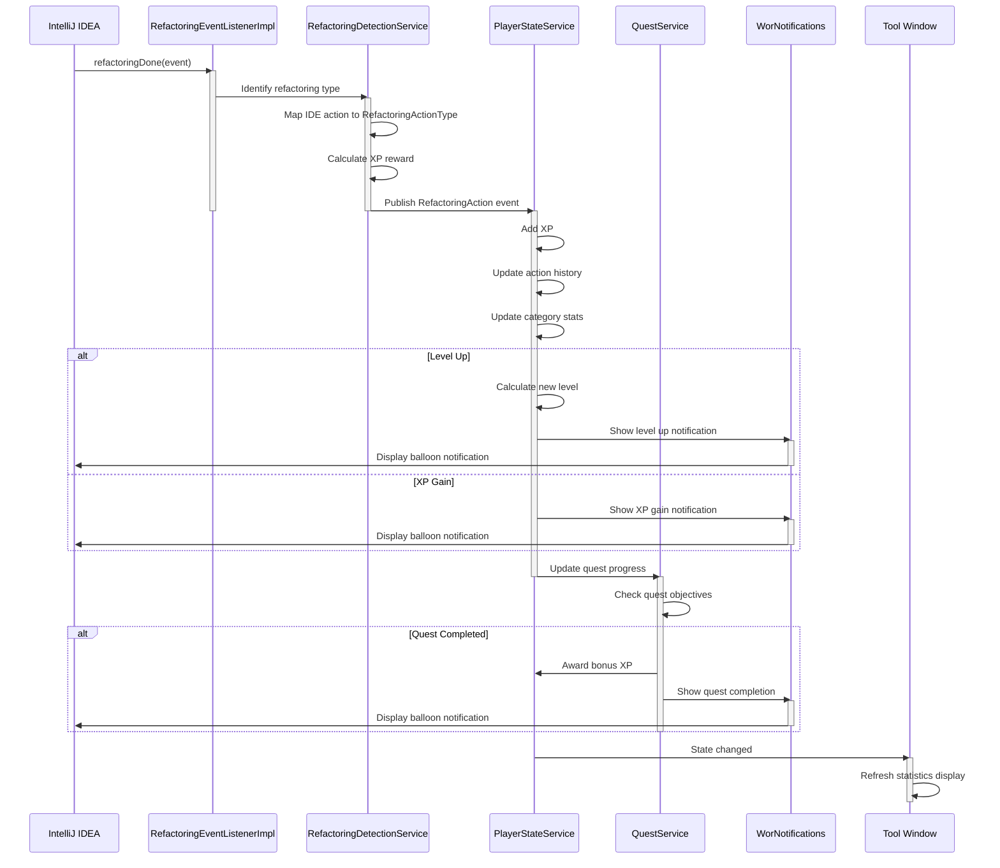

# World Of Refactoring

<!-- Plugin description -->

**World of Refactoring** transforms your IntelliJ IDEA refactoring workflow into an engaging experience! Earn XP, level
up, and complete quests as you improve your codebase.

## Features

### Progression System

- **Gain XP** for every refactoring action you perform
- **Level up** through 6 distinct tiers with unique titles and icons:
    - 🌱 **Apprentice** (Levels 1-4)
    - ⚔️ **Refactorer** (Levels 5-9)
    - 🛡️ **Expert** (Levels 10-19)
    - 🎖️ **Master** (Levels 20-29)
    - 👑 **Grand Master** (Levels 30-50)
    - 🧙 **Legend** (Level 51+)

### 📊 Comprehensive Action Tracking

Track your refactoring actions across 4 categories:

- **Code Structure** - Extract Method, Inline, Move, etc.
- **Logic & Complexity** - Simplify logic, reduce complexity
- **Data & State** - Encapsulation, data management
- **Coupling** - Dependency management

Supports 20+ refactoring types including:

- Extract Method/Variable/Constant/Interface
- Rename, Move, Copy
- Inline Method/Variable
- Change Signature
- Pull Up/Push Down
- And many more!

### 🎯 Quest System

Complete quests to earn bonus XP:

- **First Steps** - Perform your first 5 refactoring actions
- **Extract Master** - Master the Extract Method refactoring
- **Rename Champion** - Become proficient at renaming
- **The Cleaner** - Clean up your codebase
- **Refactoring Spree** - Show your dedication with consistent refactoring

### 📈 Statistics Dashboard

View detailed statistics in the dedicated tool window:

- Current level, title, and progression bar
- Total XP and actions performed
- Breakdown by action category
- Complete refactoring history

### 🔔 Real-time Notifications

Get instant feedback when you:

- Gain XP from refactoring actions
- Level up and unlock new titles
- Complete quests

### 💾 Export Your Progress

Export your statistics in multiple formats:

- **JSON** - For data analysis and integration
- **CSV** - For spreadsheet analysis
- **Markdown** - Beautiful formatted reports with level icons

## Installation

1. Open IntelliJ IDEA
2. Go to `Settings` → `Plugins` → `Marketplace`
3. Search for "World of Refactoring"
4. Click `Install` and restart your IDE

## Usage

Once installed, the plugin automatically tracks your refactoring actions:

1. **Open the Tool Window**: Find "World Of Refactoring" in the right sidebar
2. **Start Refactoring**: Perform any refactoring action (Extract Method, Rename, etc.)
3. **Watch Your Progress**: See notifications for XP gains and level ups
4. **Check Your Stats**: View detailed statistics in the Stats tab
5. **Complete Quests**: Track your progress in the Quests tab
6. **Export Your Data**: Use the export button to save your achievements

<!-- Plugin description end -->

## Architecture

### Event Flow

The plugin automatically detects and rewards refactoring actions through a sophisticated event-driven architecture:

### Key Components

- **RefactoringEventListenerImpl**: Listens to IntelliJ's refactoring events
- **RefactoringDetectionService**: Maps IDE events to game actions and calculates rewards
- **PlayerStateService**: Manages player progression, XP, and statistics (persisted)
- **QuestService**: Tracks and validates quest completion (persisted)
- **WorNotifications**: Displays balloon notifications for XP gains and achievements
- **Tool Window**: Real-time UI displaying stats, quests, and player progression

## XP Rewards

Different refactoring actions provide different XP amounts based on their complexity:

- **Extract Method/Interface**: 10 XP
- **Rename**: 5 XP
- **Inline Method**: 8 XP
- **Move/Copy**: 7 XP
- **Change Signature**: 12 XP
- **Pull Up/Push Down**: 15 XP
- And more!

## Development

Built with:

- Kotlin
- IntelliJ Platform SDK 2025.2.5
- Kotest for testing
- Gradle for build automation

## Contributing

Contributions are welcome! Feel free to:

- Report bugs
- Suggest new features
- Submit pull requests
